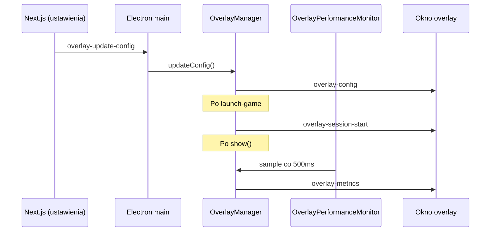

# Nakładka w grze (Overlay) — dokumentacja

Nakładka Quark to przezroczyste okno Electron wyświetlane nad grą po uruchomieniu tytułu z launchera. Umożliwia szybki podgląd wydajności systemu bez wychodzenia z gry.

## Szybki start

1. Uruchom grę z Quark (Steam / Epic / Xbox / custom).
2. Naciśnij **Ctrl+Alt+F10**, aby włączyć lub wyłączyć nakładkę.
3. Dostosuj elementy w **Ustawienia → Nakładka**.

Sesja nakładki trwa maksymalnie **8 godzin** od uruchomienia gry lub do zamknięcia aplikacji.

---

## Układ ekranu

```
┌─────────────────────────────────────────────────────────────┐
│ Quark                                    [wykres CPU]       │
│                                          CPU  GPU  FPS      │
│                                          RAM  SESJA  …      │
└─────────────────────────────────────────────────────────────┘
```

| Strefa | Pozycja | Opis |
|--------|---------|------|
| Logo | Lewy górny róg | Napis „Quark” (font Array, kolor `#d4ff00`) |
| Panel wydajności | Prawy górny róg | Wykres CPU + metryki w półprzezroczystym panelu |

Okno nakładki ma szerokość całego obszaru roboczego i wysokość **100 px**. Nie przechwytuje myszy (`setIgnoreMouseEvents(true)`).

---

## Pliki — warstwa Electron (Windows app)

| Plik | Rola |
|------|------|
| `Windows app/overlay-manager.js` | Zarządza oknem, skrótem Ctrl+Alt+F10, sesją gry, IPC `overlay-update-config`, start/stop monitora |
| `Windows app/overlay.html` | Struktura DOM nakładki |
| `Windows app/overlay.css` | Style panelu (logo, wykres, statystyki) |
| `Windows app/overlay-renderer.js` | Logika UI: rysowanie wykresu, FPS (rAF), timer sesji, zegar, ping |
| `Windows app/overlay-preload.js` | Most IPC (`overlayAPI`) dla izolowanego renderera |
| `Windows app/overlay-performance.js` | Pobieranie CPU (PowerShell / `os.cpus`), GPU (`nvidia-smi` lub WMI), RAM |
| `Windows app/main.js` | Tworzy `OverlayManager`, wywołuje `onGameLaunched()` po `launch-game` |
| `Windows app/preload.js` | `electronAPI.overlayUpdateConfig()` dla głównego okna Next.js |

### Przepływ danych



### Kanały IPC

| Kanał | Kierunek | Payload |
|-------|----------|---------|
| `overlay-update-config` | Renderer → Main | `OverlaySettings` |
| `overlay-config` | Main → Overlay | `OverlaySettings` |
| `overlay-metrics` | Main → Overlay | `{ cpu, gpu, ram, cpuHistory, ts }` |
| `overlay-session-start` | Main → Overlay | `{ startedAt }` |
| `overlay-toggled` | Main → Launcher UI | `{ visible }` |

---

## Pliki — warstwa web (Next.js)

| Plik | Rola |
|------|------|
| `web/act-l/lib/overlay-settings.ts` | Typ `OverlaySettings`, domyślne wartości, `syncOverlayConfigToElectron()` |
| `web/act-l/lib/settings-context.tsx` | Pole `settings.overlay`, `updateOverlaySettings()`, auto-sync do Electron |
| `web/act-l/components/settings-modal.tsx` | Zakładka **Nakładka** z przełącznikami elementów |
| `web/act-l/lib/telemetry/provider.tsx` | Event `overlay.toggled` przy przełączeniu skrótem |

### `OverlaySettings` — dostępne przełączniki

| Klucz | Domyślnie | Opis |
|-------|-----------|------|
| `showLogo` | `true` | Logo Quark |
| `showCpu` | `true` | % CPU |
| `showGpu` | `true` | % GPU |
| `showFps` | `true` | FPS (szacunek okna nakładki) |
| `showCpuChart` | `true` | Mini wykres historii CPU (48 próbek) |
| `showRam` | `true` | % RAM systemu |
| `showSessionTimer` | `true` | Czas sesji od launchera |
| `showDateTime` | `false` | Zegar HH:MM |
| `showPing` | `false` | Ping do `fra.cloud.appwrite.io/health` |

Ustawienia zapisywane są w `settings.json` (klucz `overlay`) przez `saveUserData('settings', …)`.

---

## Metryki — ograniczenia i dokładność

### CPU
- **Windows:** `Get-Counter '\Processor(_Total)\% Processor Time'`
- **Fallback:** różnica `os.cpus()` między próbkami

### GPU
1. `nvidia-smi --query-gpu=utilization.gpu` (karty NVIDIA)
2. Fallback: `Get-Counter '\GPU Engine(*)\Utilization Percentage'` (Windows 10+)

Bez NVIDIA i bez liczników GPU wartość może być **0%**.

### FPS
Mierzone przez `requestAnimationFrame` w oknie nakładki — to **nie są** klatki w grze, tylko odświeżanie samej nakładki (zwykle ~monitor refresh rate gdy widoczna).

### Ping
Pojedynczy request co 15 s; wynik zależy od sieci i dostępności endpointu health.

---

## Przeciąganie gier i kategorii (drag & drop)

Kolejność jest persystowana w ustawieniach użytkownika.

| Plik | Rola |
|------|------|
| `web/act-l/lib/game-order.ts` | `sortGamesByOrder`, `reorderIds`, `buildOrderFromGames` |
| `web/act-l/hooks/use-drag-reorder.ts` | Hook HTML5 DnD |
| `web/act-l/components/sortable-game-item.tsx` | Opakowanie karty gry z uchwytem przeciągania |
| `web/act-l/components/draggable-category-row.tsx` | Przeciąganie całej sekcji kategorii na Home |
| `web/act-l/components/home-view.tsx` | DnD w kategoriach i sekcji biblioteki |
| `web/act-l/components/library-view.tsx` | DnD w siatce/listie (sort „Własna kolejność”) |

### Pola w `AppSettings`

| Pole | Opis |
|------|------|
| `libraryGameOrder` | `string[]` — kolejność ID gier (Home + Biblioteka) |
| `librarySortBy` | `'custom'` po pierwszym przeciągnięciu w bibliotece |
| `customCategories[].gameIds` | Kolejność gier wewnątrz kategorii |
| `customCategories` (kolejność tablicy) | Kolejność sekcji na Home |

### Jak używać

- **Home:** przeciągnij kartę gry (uchwyt po najechaniu) w karuzeli kategorii lub biblioteki; przeciągnij nagłówek sekcji kategorii, aby zmienić kolejność kategorii.
- **Biblioteka:** wybierz sortowanie „Własna kolejność” lub przeciągnij kartę — kolejność zapisze się automatycznie.

---

## Telemetria

Przełączenie nakładki skrótem wysyła event `overlay.toggled` z `{ visible: boolean }` (kategoria `feature`).

---

## Rozwiązywanie problemów

| Problem | Możliwa przyczyna |
|---------|-------------------|
| Skrót nie działa | Gra nie uruchomiona z Quark lub skrót zajęty przez inną aplikację |
| GPU zawsze 0% | Brak `nvidia-smi` / brak liczników GPU w Windows |
| Nakładka niewidoczna | Pełny ekran exclusive — spróbuj okna lub borderless |
| Ustawienia nie stosują się | Uruchom z buildem Electron (nie sam `next dev` w przeglądarce) |
| Port 30211 zajęty | Electron automatycznie wybierze 30212, 30213… (`dev-server.js`) |

---

## Powiązana dokumentacja

- `docs/API-REFERENCE.md` — IPC launchera i telemetria
- Onboarding tour — krok „overlay” w `web/act-l/components/onboarding/app-tour.tsx`
